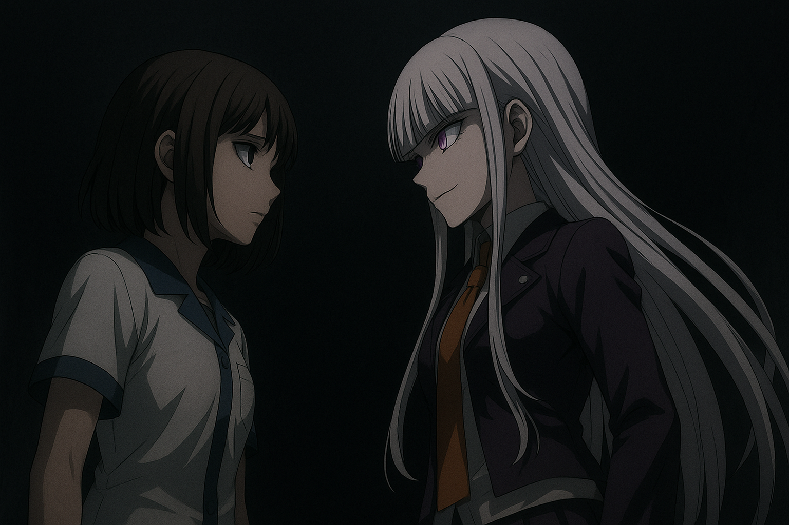

# 🎭 EVELLY ADVENTURE
### *Sobreviva às sombras de Noxhaven*

---

## 📖 Sobre o Jogo

**Evelly Adventure** é uma visual novel de terror psicológico que mergulha você nas profundezas da mente traumatizada de Evelly, uma artista de teatro que precisa confrontar seus demônios internos em uma jornada sombria através de suas memórias e culpa.

Explore os corredores distorcidos de **Noxhaven**, uma realidade fragmentada onde cada escolha molda seu destino, cada diálogo revela verdades ocultas, e cada sombra pode ser sua última ameaça.

---

## 🎮 Características

### 🌑 Sistema de Terror Dinâmico
- **Jumpscares Aleatórios**: Sistema inteligente que escolhe entre 11 imagens de jumpscare diferentes
- **Intensidade Personalizável**: 4 níveis de intensidade (Baixo, Médio, Alto, Extremo)
- **Atmosfera Imersiva**: Efeitos visuais de glitch, tremor de tela e distorções

### ⚔️ Combate e Ação
- **Sistema de Munição**: Gerencie cuidadosamente suas balas limitadas
- **Encontros com Sombras**: Enfrente manifestações físicas de seus traumas
- **Minigames de Controle**: Teste sua resistência mental em momentos críticos

### 🎯 Escolhas Significativas
- **Sistema de Karma**: Suas ações afetam diretamente o desfecho da história
- **Múltiplas Ramificações**: Decisões morais que alteram completamente a narrativa
- **Rotas Alternativas**: Caminhos únicos baseados em suas escolhas anteriores

### 🧩 Puzzles e Desafios
- **Puzzle do Piano**: Reproduza a melodia macabra enquanto manequins observam
- **Labirinto Temporal**: Escape antes que o tempo acabe
- **Painéis Biométricos**: Decodifique sequências enquanto evita colapsos

### 💾 Sistema de Save Completo
- **Quick Save**: Salve rapidamente com F5 durante o jogo
- **Auto Save**: Salvamento automático a cada 5 minutos
- **Seleção de Capítulos**: Comece diretamente de qualquer capítulo desbloqueado

---

## 📚 Capítulos

### **Capítulo 1: O Despertar**
Evelly acorda em um lugar desconhecido. As memórias estão fragmentadas, e a realidade parece distorcida.

### **Capítulo 2: O Setor das Vozes**
Vozes sussurram segredos esquecidos. Cada corredor revela mais sobre o passado sombrio.

### **Capítulo 3: A Tragédia Esquecida**
No teatro abandonado, Evelly confronta a verdade sobre o incêndio. O puzzle do piano guarda segredos mortais.

### **Capítulo 4: Fragmentos da Verdade**
A realidade se fragmenta. Evelly descobre que nem tudo é o que parece.

### **Capítulo 5: O Coração do HollowMind**
Chegando ao núcleo do experimento, a verdade sobre a Névoa é revelada.

### **Capítulo 6: Renascimento ou Eternidade**
**Duas rotas distintas:**
- **Rota Solo**: Enfrente seus demônios sozinha em um teste final de controle mental
- **Rota com Erza**: A companhia muda tudo, mas nem toda ajuda é bem-vinda

### **Capítulo 7: O Fim ou o Recomeço**
Todas as escolhas culminam aqui. Seu karma define qual será seu destino final.

---

## 🏆 Finais Disponíveis

O jogo possui **MÚLTIPLOS FINAIS** baseados em:
- Seu **nível de Karma** total
- **Escolhas críticas** em momentos-chave
- **Relacionamento com Erza** (se ela sobreviveu)
- **Confronto com seus traumas**

### 🌟 Finais Principais:

#### 🔴 **Final 1: Tragédia Absoluta**
- Evelly sucumbe à loucura
- A Névoa consome completamente sua mente
- **Requisito**: Karma muito baixo e escolhas egoístas

#### 🔵 **Final 2: Libertação**
- Evelly confronta sua culpa e encontra paz
- Descoberta do Projeto Névoa
- **Requisito**: Karma alto e escolha heroica no flashback

#### 🟢 **Final 3: Renascimento** (Rota com Erza)
- Evelly e Erza escapam juntas
- Nova chance de recomeçar
- **Requisito**: Erza viva, Karma positivo, escolhas de controle

#### 🟣 **Final 4: Eternidade** (Rota Solo)
- Evelly aceita seu destino na Névoa
- Loop eterno de confronto
- **Requisito**: Rota solo, falha no minigame de controle

#### ⚫ **Final 5: Bad Ending - Autodestruição**
- Evelly desiste completamente
- **Requisito**: Escolher atirar em si mesma

---

## 🎨 Recursos Técnicos

### 🖼️ Arte e Visuais
- **11+ Cenários únicos**: Desde teatros macabros até corredores de carne pulsante
- **Sprites de personagens**: Múltiplas expressões para Erza
- **11 Imagens de Jumpscare**: Variedade para manter o terror imprevisível

### 🎵 Sistema de Áudio
- **Música de Fundo Dinâmica**: Muda conforme a tensão da cena
- **Efeitos Sonoros**: Gunshots, passos, sussurros, gritos
- **Controles Independentes**: Volume separado para música, efeitos e master

### 💻 Interface
- **HUD Dinâmico**: Karma, munição e opções sempre visíveis
- **Barra de Karma Visual**: Acompanhe seu alinhamento moral em tempo real
- **Menu Estilizado**: Tema de terror com efeitos de sangue e glitch

---

## 🎯 Como Jogar

### Controles:
- **Mouse**: Clique para avançar diálogos e fazer escolhas
- **Espaço**: Disparar arma em modo de combate
- **F5**: Quick Save
- **ESC**: Voltar ao menu principal

### Dicas:
- ⚠️ **Gerencie sua munição**: Balas são limitadas e preciosas
- 💭 **Escolhas importam**: Cada decisão afeta seu karma e o final
- 🎹 **Preste atenção nos puzzles**: Você tem tentativas limitadas
- 💾 **Salve com frequência**: O terror pode te pegar de surpresa
- 🎭 **Explore todos os diálogos**: Pistas importantes estão escondidas nas conversas

---

## 🌟 Créditos

**Evelly Adventure** foi criado com:
- **Engine**: Electron
- **Linguagem**: JavaScript (Vanilla)
- **Framework**: HTML5 + CSS3
- **Fontes**: Creepster, Nosifer, Orbitron

### Tecnologias Utilizadas:
- Sistema de diálogos customizado
- Save system com IPC do Electron
- Audio manager dinâmico
- Sistema de karma e flags
- Renderização de personagens em tempo real

---

## 📦 Informações Técnicas

- **Versão**: 1.0.0
- **Plataforma**: Windows (x64)
- **Requisitos Mínimos**: Windows 7 ou superior
- **Tamanho**: ~100MB (incluindo todos os assets)

---

## 🎁 Mensagem Especial

Este jogo foi criado como um presente especial. Cada cena, cada jumpscare, cada escolha foi pensada para criar uma experiência única de terror psicológico.

**Evelly Adventure** não é apenas um jogo - é uma jornada através da culpa, do medo e da redenção.

---

### 🎭 *"No final, todos nós enfrentamos nossas sombras."* 🎭

**Obrigado por jogar!**

Made with 💀 and 🎮

